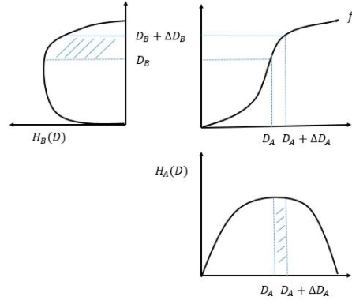

## 大作业Ⅰ: Histogram Equlization

### Part1: Introduction

#### 灰度图像

我们知道，图像是由像素 (*pixel*) 构成的.

一般的彩色图片由 RGB 三个通道 (*channel*) 组成, 为了简便, 本次作业只需要对灰度图像 (*gray-scale image*) 进行操作. 

一张图片, 可以理解为像素阵. 灰度图像的颜色, 即灰度 (*intensity*) 由该像素位置上的灰度值决定. 本次作业中, 灰度值的范围是0~255, 其中0表示黑色, 255表示白色. 这也是我们使用C++中`unsigned char`类型存储灰度的原因.

#### 图像增强

由于图像获取, 传输过程中信号的损失和噪声的引入, 图像很容易获得不好的效果.

因此我们需要使用一些算法进行图像增强 (*Image enhancement*) , 这样可以帮助我们获得更好的视觉效果.

在`pic`文件夹中, 助教给你准备了四张图片, `1_in.png`到`4_in.png`, 并且很贴心地给你写好了Python脚本`histo_eq.py`, 来向你展示经过图像增强后图片的视觉效果(`1_out.png` 到 `4_out.png`).

### Part2: Algorithm

我们采取的图像增强算法叫做 *Histogram Equalization*.

算法的原理我会在习题课上进行讲解, 并且向你提供一些资料.



$[a]\;[b]$
$\quad\;[c]$

***b*** 图的横轴是灰度, 纵轴是百分比. 这个曲线叫做 累积分布函数 (***CDF***), 意思是灰度不超过某个值的像素点在整张图象中的占比.

***a*** 图是 ***b*** 图中微分, ***c*** 图是 ***a*** 图摆正了坐标轴. 这时 ***c*** 图就是 ***b*** 图中的导数, 叫做 概率密度函数 (***PDF***).

我们先将 *CDF* 拉伸到255, 然后求得反函数, 记作 ***d***. 然后将 ***d*** 作为灰度到灰度的映射, 最后将这个映射作为我们的变换函数.


### Part3: 作业要求

#### 必做任务

1. 实现 Histogram Equalization 算法, 应用并展示你的结果.
2. 作出直方图说明 Histogram Equalization 的原理, 由此分析算法的效果.
3. 写一个报告, 展现你完成这个作业的方法以及你对这个问题的思考. 此外，你应该自己寻找一些图片(脚本会将彩色图片处理成灰度图片)用于分析算法的效果. 
4. bonus 选做任务.

#### 选做任务
本次大作业有两个bonus可选.

1. 实现Histogram Matching 算法 (提示：求Histogram Equalization的逆变换).
2. 实现图像边缘锐化（提示：可考虑卷积或者是对图像求空间上的导数）.


### Part4: 文件结构

你需要修改的代码有:
- `transform.hpp` 请在里面实现你的图像增强算法
- `histogram.hpp` 请在里面进行数据可视化, 画出一张图像的灰度直方图

我们提供了以下的工具代码来帮助你顺利地进行本次实验：
- `encode.py`    Python脚本, 编码一张.png图像
- `decode.py`    Python脚本, 将中间结果保存为.png图像
- `histo_eq.py`   Python脚本, 调包实现equalizeHist算法，可以用于检测算法的正确性
- `main.cpp`      main函数

以下是在运行过程中产生的中间文件：
- `in.txt`    存储中间结果, 请勿修改
- `out.txt`  存储中间结果, 请勿修改

以下是程序产生的输出文件：
- `histo0.txt`    均衡化前的直方图
- `histo1.txt`    均衡化后的直方图
- `out.png`     处理后的图像
- `ans.png`   使用调包实现的equalizeHist算法处理后的图像


#### transform.hpp

 `h` 和 `w` 表示图像的长和宽

`image` 是一个灰度数组, 表示原始图片, `_image` 是另一个灰度数组, 表示变换后的图片. 你需要实现你的算法, 将灰度值存到`_image`中去.

我帮你实现了一个恒等变换作为例子.

#### histogram.hpp

`image` 是一个灰度数组, 表示要画灰度直方图的图片.

请使用输出函数和符号画一个灰度直方图, 我帮你重定向了输出, 这样你的灰度图会被保存在`filename`文件中, 并且不会输出在命令行中.

下面是你的实现的参考效果.

```
     31 |          2 | ==
     63 |          6 | ======
     95 |          2 | ==
     	.           .
     	.           .
     	.           .
    255 |          4 | ====
```

你可以尽情发挥, 怎么好看怎么来~
你甚至可以使用其他语言或工具，如Python的`matplotlib`,MATLAB脚本或者R语言.
但是必须要让你的实现能像一个可执行文件或脚本运行起来(不难理解, Ctrl+c复制进Excel里面画的图肯定是没分的).

### Part5: How to start?
本次大作业请全程在**WSL或MacOS**环境下进行.

#### 准备工作
使用 `sudo apt install python3-pip` 安装包管理器`pip`

使用 `pip install numpy opencv-python` 安装科学计算包`numpy`和计算机视觉包`opencv`

#### Python脚本使用方法
在shell中输入下列命令即可运行相应的Python脚本.

```bash
python3 脚本名字.py
```
你还可以为某些Python脚本指定参数，例如如果你想修改``encode.py``的输入图片为`2_in.png`，你可以使用下列命令.
```bash
python3 ./encode.py --file_path ./pic/2_in.png
```

#### 编译命令

当你想运行代码的时候, 请输入`g++ -O2 -o main main.cpp` 进行编译.

注意, 你可以指定main.cpp中保存直方图的文件

编译完成后可通过下列命令直接获得经过处理后的图像.

`python3 encode.py --file_path {你的图片路径(默认是./pic/1_in.png)} && ./main < in.txt && python3 decode.py --file_path {你保存的图片路径(默认是out.png)}`

这样你可以得到变换后的图像文件, 以及被**重写** (写覆盖) 的直方图文件.


### 附录: 补充资料

[1] https://en.wikipedia.org/wiki/Histogram_equalization

[2] *Digital Image Process* by Rafael C.Gonzalez, 4th edition

[3] 课上讲解的Slides
